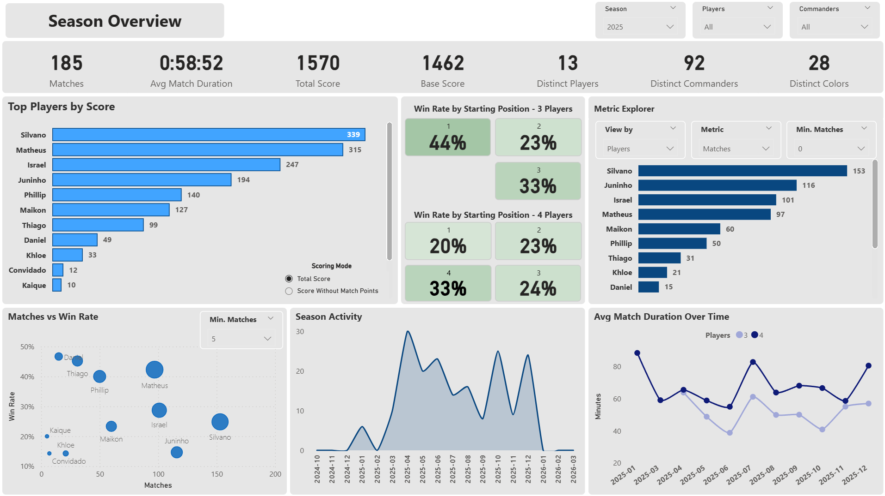
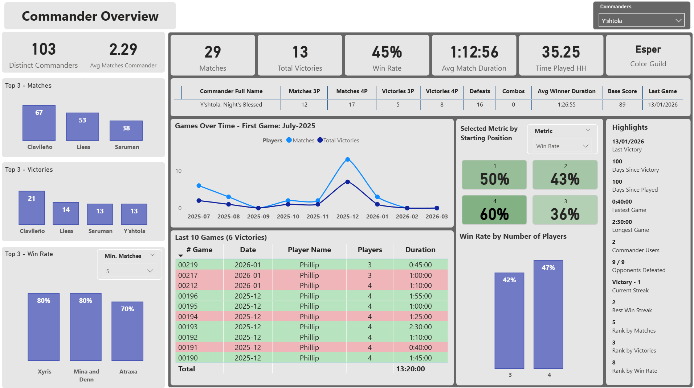

# 🎯 Magic: The Gathering BI Analytics Project

## Project Overview

This project is an end-to-end Business Intelligence solution built to analyze Magic: The Gathering Commander games.

It simulates a real-world analytics workflow, covering the full pipeline:
- Data extraction from external sources
- Data transformation and validation
- Data modeling in a relational database
- Interactive dashboard creation

The goal is to demonstrate strong fundamentals in data engineering, data modeling, and business intelligence.

## Architecture

Google Sheets → Python ETL → PostgreSQL → Power BI

## Tech Stack

- **Python** — Data extraction, transformation, and loading (ETL)
- **PostgreSQL** — Data storage and modeling (star schema)
- **Power BI** — Data visualization and dashboarding
- **Google Sheets** — Data source

## Data Model

The project follows a **star schema design**.

### Fact Table
- `FACT_GAMES` → 1 row per player per game

### Dimension Tables
- `DIM_PLAYER`
- `DIM_COMMANDER`
- `DIM_COLOR`
- `DIM_SEASON`
- `DIM_SCORE_RULE`

## ETL Process

### Extract
- Data is extracted from Google Sheets using Python

### Transform
- Data cleaning and validation
- Type conversion (dates, booleans, durations)
- Business rules applied
- Error handling and logging

### Load
- Full refresh strategy:
  - `TRUNCATE` + `INSERT`
- Data loaded into PostgreSQL

## Key Features

- Dynamic performance metrics:
  - Matches
  - Victories (3-player and 4-player)
  - Win rate
  - Score calculation
  - Combos tracking

- Data validation:
  - Invalid rows detection and logging
  - Format validation (duration, color, etc.)

- Modular architecture:
  - `extract`, `transform`, `load` separation
  - Reusable components

## SQL Layer

In addition to the Python ETL pipeline, this project includes SQL scripts responsible for analytical logic inside PostgreSQL.

This layer is used to:
- reproduce ranking rules directly in the database
- apply business logic for leaderboard eligibility
- generate final analytical tables consumed by Power BI

Example:
- `sql/ranking_points.sql` → creates the `ranking_points` table with bonus score logic by player and season

## Dashboard

### Season Overview

### All Seasons Overview

## Season Overview Description

This page was designed to provide a high-level analytical view of match activity, player performance, and score distribution across the dataset. It combines core KPIs, score-based rankings, efficiency indicators, and trend analysis to support both broad monitoring and deeper performance interpretation.

A central part of this view is the relationship between **volume and efficiency**. The page allows performance to be interpreted not only through total matches and accumulated score, but also through win rate, starting position results, and the impact of different game sizes. It also includes a scoring perspective that helps distinguish players who lead through consistency and participation from those who stand out through stronger efficiency.

The project includes two complementary versions of this page:
- **Single Season Overview** — focused on one selected season at a time
- **All Seasons Overview** — focused on the full historical view

This split was intentionally adopted to preserve analytical consistency, since some calculations and ranking behaviors differ between season-specific and all-time contexts.

### Commanders Overview

## Commander Overview Description

This page was designed as a commander-centered analytical view, combining overall context with a detailed breakdown of an individually selected commander.

It includes:
- general commander benchmarks and top-3 comparisons
- selected commander KPIs and summary metrics
- performance over time
- recent match history
- contextual highlights such as streaks, ranks, opponents defeated, and usage patterns
- breakdowns by starting position and number of players

The goal of this page is to move beyond simple aggregate metrics and provide a more tactical understanding of how a specific commander performs, how often it is used, under which conditions it performs better, and how its recent trajectory compares with its broader historical profile.

*More screenshots will be added here.*

Example structure:

- Main dashboard
- Player performance analysis
- Commander analysis
- Score breakdown

## Additional Analytics (Python Layer)

The project also includes a Python-based analytics layer to:

- Reproduce BI metrics outside Power BI
- Validate calculations between layers
- Perform advanced analysis not easily handled in dashboards

Example use case:
- Player vs opponent performance analysis

## How to Run

1. Clone the repository:

    git clone https://github.com/thiago-mattos-santos/magic-bi-analytics.git

2. Navigate to the project folder:

    cd magic-bi-analytics

3. Create a `.env` file based on `.env.example`

4. Install dependencies:

    pip install -r requirements.txt

5. Run the pipeline:

    python src/main.py

## Future Improvements

- SQL validation layer for metric verification
- Dashboard enhancements and storytelling improvements
- PySpark implementation for scalability
- Cloud pipeline simulation (scheduled execution)
- Data quality monitoring
- Python-based dashboard and metrics replication

## Project Status

This project is actively maintained and continuously improved to simulate real-world data workflows.

## Author

Thiago Mattos Santos
